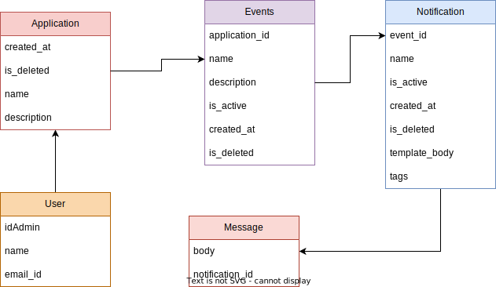

# Notification Microservice

The Notification Service Microservice is responsible for setting up event-based email notifications for applications within an organization. It allows administrators to configure notifications, manage applications, events, and notification types, and send messages to users based on various events. This readme provides an overview of the microservice's functionality, terminology, and user stories.

## Terminologies
- **Application**: A product used by the organization.
- **Event**: An operation in an application that triggers email notifications to users (e.g., assigning a training to an employee).
- **Notification**: Different types of notifications triggered by an event (e.g., Trainee Notification, Manager Notification).
- **Template**: A blueprint for creating email messages with placeholders for metadata.
- **Message**: An email created using a template and sent to the user.
- **Metadata**: Information used to fill placeholders in templates (e.g., course title, course code, username)


## Features

- Log in to Notification Service UI
- Application:
    - Add Application
    - Modify application information.
    - Deactivate an application to prevent message sending.
    - Delete Application:
- Event:
    - Add Events to applications for triggering notifications.
    - Modify event information.
    - Deactivate an event to prevent message sending.
    - Delete Event:
- Notification:
    - Add Notification Types to the Events.
    - Update Notification information.
    - Delete Notifications
    - Deactivate Notifications to prevent sending message.
- Message:
    - Add custom messages using metadeta and tags to the enduser's notifications.
    - Suggesting Tags while writing notification message. (Type **{{** to trigger suggestions)

## Installation

To run this application, you have the option to use Docker for a streamlined setup or run individual npm scripts for the frontend and backend separately.

```shell
# Using Docker
docker build -t your-app-name .
docker run -p 80:80 your-app-name
```

### FrontEnd
    cd frontend
    npm install --force
    npm run start
    
### Backend
    cd backend
    npm install
    npm run start


## Environment Variables

To run this project, you will need to add the following environment variables to your environment and also create configuration files for both the submodules.

#### Frontend

For the frontend submodule, create a `.env` file in the `frontend` directory and add the following environment variable with your desired value:

```plaintext
VITE_BASE_URL=your_frontend_base_url
```
#### Backend
For the backend submodule, you need to set the following environment variable:
```plaintext
SECRET_KEY=your_secret_key
```

In addition to environment variables, create configuration files for the submodules with the following placeholders:

#### custom-environment-variables.json (For Backend)

    {
        "database": {
            "postgresdb": {
                "connection": {
                    "password": "notify_postgres_password"
                }
            },
            "SECRET_KEY": "your_secret_key",
            "MONGO_DB_URL": "MONGO_DB_URL"
        }
    }

#### development.json (For Backend)

    {
        "server": {
            "port": 3000
        },
        "database": {
            "dbName": "mongodb",
            "postgresdb": {
                "connection": {
                    "database": "Notify",
                    "user": "postgres"
                }
            },
            "mongodb": {
                "connectionString": "your_mongodb_connection_string"
            }
        }
    }

Replace the placeholders (e.g., your_frontend_base_url, your_secret_key, your_mongodb_connection_string) with your actual values.


## API Reference


### Application
```plaintext
  GET /api/applications
  POST /api/applications
  PATCH /api/applications/:id
  GET /api/applications/:id
```
### Event
```plaintext
  GET /api/events
  POST /api/events
  PATCH /api/events/:id
```
### Notication
```plaintext
  GET /api/notifications
  POST /api/notifications
  PATCH /api/notifications/:id
```

| Parameter | Type     | Description                |
| :-------- | :------- | :------------------------- |
| `name` | `string` | **Optional**. Name of the Application/Event/Notication |
| `Description` | `string` | **Optional**. Description of the Application/Event/Notication |
| `isActive` | `boolean` | **Optional**.  Active status |
| `created_at` | `string` | **Optional**. Creation date |
| `sort` | `string` | **Optional**. Sort order |
| `sortby` | `string` | **Optional**. Coloumn to sort|
| `page` | `int` | **Optional**. Get a specific page number from a paginated response |
| `limit` | `int` | **Optional**. Give a number of responses on a single page |
| `applicationId` | `string/int` | **Required**. As Query param when requesting for Events |
| `eventId` | `string/int` | **Required**. As Query param when requesting for Notiications |

### Others
```plaintext
  GET /api/tags
  POST /api/auth
  PATCH /api/users
```


## Class Diagram



## Let's Discuss Ideas
[](mailto:hassannaeem53@gmail.com)
[](https://[www.linkedin.com/](https://www.linkedin.com/in/hassan-naeem-357001192/)) 


